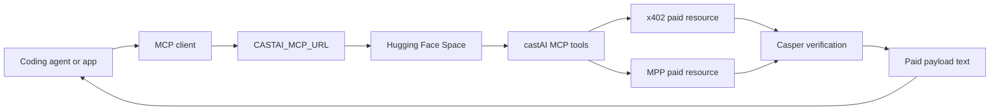

# castAI

Casper CSPR payments for x402, MPP, and AI agents.

castAI provides TypeScript packages for services and agents that need paid HTTP
requests settled on Casper.

## Packages

| Package | Purpose |
| --- | --- |
| `@castaisdk/ai-sdk` | AI SDK tools, `generateCastaiText`, `llm.text`, checkout UI, and React developer components |
| `@castaisdk/cli` | Scaffolder and config generator for checkout, agent, and MCP projects |
| `@castaisdk/mcp` | MCP server for x402 and MPP paid-resource tools |
| `@castaisdk/x402` | x402 `exact` scheme support for Casper CSPR transfers |
| `@castaisdk/mpp` | MPP `casper` charge method for native CSPR transfers |
| `@castaisdk/facilitator` | x402 verification and settlement service for Casper payments |
| `@castaisdk/router` | x402 payment router for protected HTTP resources |

## Install

```sh
npm install @castaisdk/ai-sdk ai @castaisdk/x402 @castaisdk/mpp casper-js-sdk
```

```sh
pnpm add @castaisdk/ai-sdk ai @castaisdk/x402 @castaisdk/mpp casper-js-sdk
```

```sh
yarn add @castaisdk/ai-sdk ai @castaisdk/x402 @castaisdk/mpp casper-js-sdk
```

```sh
bun add @castaisdk/ai-sdk ai @castaisdk/x402 @castaisdk/mpp casper-js-sdk
```

CLI and MCP:

```sh
npm install -g @castaisdk/cli
npm install @castaisdk/mcp
```

```sh
pnpm add -g @castaisdk/cli
pnpm add @castaisdk/mcp
```

```sh
yarn global add @castaisdk/cli
yarn add @castaisdk/mcp
```

```sh
bun add -g @castaisdk/cli
bun add @castaisdk/mcp
```

## AI Agent

```ts
import { generateCastaiText } from "@castaisdk/ai-sdk";

const result = await generateCastaiText({
  model: process.env.AI_MODEL ?? "openai/gpt-4.1",
  x402: {
    networks: ["casper:testnet"],
    privateKeyPem: process.env.CASPER_PRIVATE_KEY_PEM,
  },
  mpp: {
    network: "casper:testnet",
    privateKeyPem: process.env.CASPER_PRIVATE_KEY_PEM,
  },
  prompt:
    "Fetch the paid x402 weather resource at https://api.example.com/weather and summarize the JSON.",
});

console.log(result.text);
```

## Checkout UI

React component:

```tsx
import { createCasperX402Fetch } from "@castaisdk/ai-sdk";
import { CastaiCheckout } from "@castaisdk/ai-sdk/react";

const x402Fetch = createCasperX402Fetch({
  networks: ["casper:testnet"],
  privateKeyPem: process.env.CASPER_PRIVATE_KEY_PEM,
});

export function Checkout() {
  return (
    <CastaiCheckout
      amount="0.001"
      network="casper:testnet"
      recipient={process.env.CASPER_RECIPIENT}
      request={{ url: "https://api.example.com/protected" }}
      scheme="x402"
      x402Fetch={x402Fetch}
    />
  );
}
```

Headless React state:

```tsx
import { useCastaiPayment } from "@castaisdk/ai-sdk/react/headless";

export function PayButton({ x402Fetch }) {
  const payment = useCastaiPayment({
    request: { url: "https://api.example.com/protected" },
    scheme: "x402",
    x402Fetch,
  });

  return (
    <button disabled={!payment.canSubmit} onClick={() => payment.submit()}>
      Pay
    </button>
  );
}
```

## Framework Adapters

```ts
import { createCastaiVercelAITools } from "@castaisdk/ai-sdk/adapters/vercel-ai";
import { createCastaiOpenAITools } from "@castaisdk/ai-sdk/adapters/openai";
import { createCastaiLangChainTools } from "@castaisdk/ai-sdk/adapters/langchain";
import { createCastaiAgentKitActionProvider } from "@castaisdk/ai-sdk/adapters/agentkit";
import { createCastaiGoatPlugin } from "@castaisdk/ai-sdk/adapters/goat";
```

## MCP and CLI

The MCP server exposes castAI tools over Streamable HTTP. The hosted Hugging Face
Space uses port `7860` and these paths:

| Path | Purpose |
| --- | --- |
| `/health` | JSON health check and endpoint list |
| `/mcp` | Streamable HTTP MCP endpoint |
| `/gradio_api/mcp` | Hugging Face/Gradio-compatible MCP endpoint |
| `/gradio_api/mcp/sse` | SSE-compatible MCP endpoint |

If the Space is deployed as `fozagtx/castai-mcp`, the public endpoint is:

```sh
export CASTAI_MCP_URL="https://fozagtx-castai-mcp.hf.space/mcp"
```

If the Space is deployed under another Hugging Face owner or Space name, use this
format:

```sh
export CASTAI_MCP_URL="https://<hf-owner>-<space-name>.hf.space/mcp"
```

Health check the deployed Space before wiring it into an agent:

```sh
curl "https://fozagtx-castai-mcp.hf.space/health"
```

Generate Claude Code MCP config for the hosted endpoint:

```sh
castai claude-code --url "$CASTAI_MCP_URL" --json
```

Write the config to `.mcp.json`:

```sh
castai claude-code --url "$CASTAI_MCP_URL" --json > .mcp.json
```

The JSON shape is:

```json
{
  "mcpServers": {
    "castai": {
      "url": "https://fozagtx-castai-mcp.hf.space/mcp"
    }
  }
}
```

Generate local stdio MCP config instead of using the hosted endpoint:

```sh
castai claude-code --package-manager npm --json
castai claude-code --package-manager pnpm --json
castai claude-code --package-manager yarn --json
castai claude-code --package-manager bun --json
```

Run the MCP server yourself:

```sh
castai-mcp
PORT=7860 castai-mcp-http
```

CLI commands:

```sh
castai templates
castai scaffold next-checkout ./my-checkout --package-manager pnpm
castai scaffold agent-vercel-ai ./my-agent --package-manager pnpm
castai scaffold mcp-claude-code ./my-mcp-config --package-manager pnpm
castai doctor --json
castai mcp-config --url "$CASTAI_MCP_URL" --json
castai claude-code --url "$CASTAI_MCP_URL" --json
```

Claude Code plugin files are in `plugins/claude-code/castai`.

Hugging Face Docker Space files are in `spaces/huggingface-mcp`.

Required Hugging Face Space secrets for real Casper payments:

```sh
CASTAI_CASPER_PRIVATE_KEY_HEX=
CASTAI_CASPER_PRIVATE_KEY_PEM=
CASTAI_CASPER_PUBLIC_KEY=
CASTAI_CASPER_NETWORK=casper:testnet
CASTAI_CASPER_KEY_ALGORITHM=ed25519
```

Use either `CASTAI_CASPER_PRIVATE_KEY_HEX` or
`CASTAI_CASPER_PRIVATE_KEY_PEM`. Set `CASTAI_CASPER_NETWORK` to
`casper:mainnet` only when the signer is funded for mainnet.



Programmatic DOM mount:

```tsx
import { createCasperX402Fetch } from "@castaisdk/ai-sdk";
import { renderCastaiCheckout } from "@castaisdk/ai-sdk/react";

const x402Fetch = createCasperX402Fetch({
  networks: ["casper:testnet"],
  privateKeyPem: process.env.CASPER_PRIVATE_KEY_PEM,
});

await renderCastaiCheckout({
  amount: "0.001",
  container: "#castai-checkout",
  network: "casper:testnet",
  recipient: process.env.CASPER_RECIPIENT,
  request: { url: "https://api.example.com/protected" },
  scheme: "x402",
  x402Fetch,
});
```

## x402

Server:

```ts
import { HTTPFacilitatorClient, x402ResourceServer } from "@x402/core/server";
import { registerExactCasperScheme } from "@castaisdk/x402/server";

const server = new x402ResourceServer(
  new HTTPFacilitatorClient({ url: process.env.FACILITATOR_URL })
);

registerExactCasperScheme(server, {
  networks: ["casper:testnet"],
});
```

Client:

```ts
import { x402Client } from "@x402/core/client";
import { registerExactCasperClientScheme } from "@castaisdk/x402/client";

const client = new x402Client();

registerExactCasperClientScheme(client, {
  networks: ["casper:testnet"],
  privateKeyPem: process.env.CASPER_PRIVATE_KEY_PEM,
});
```

## MPP

Server:

```ts
import { Mppx } from "mppx/server";
import { casper } from "@castaisdk/mpp/server";

const mppx = Mppx.create({
  methods: [
    casper({
      network: "casper:testnet",
      recipient: process.env.CASPER_RECIPIENT,
    }),
  ],
});
```

Client:

```ts
import { Mppx } from "mppx/client";
import { casper } from "@castaisdk/mpp/client";

const mppx = Mppx.create({
  methods: [
    casper({
      network: "casper:testnet",
      privateKeyPem: process.env.CASPER_PRIVATE_KEY_PEM,
    }),
  ],
});
```

## Agent-Readable Docs

The documentation exposes AI-readable Markdown routes:

| Route | Purpose |
| --- | --- |
| `/llms.txt` | Index of docs pages for coding agents |
| `/llms-full.txt` | Full Markdown export of docs pages |
| `/docs-md/...` | Markdown for a single docs page |
| `/skills/openclaw.md` | OpenClaw skill for castAI builds |

Each docs page also includes top actions for copying Markdown, viewing Markdown,
opening the page in ChatGPT, and opening the source on GitHub.

## Development

```sh
npm install --ignore-scripts
npm run lint
npm run typecheck
npm run build
```

```sh
pnpm install --ignore-scripts
pnpm lint
pnpm typecheck
pnpm build
```

```sh
yarn install --ignore-scripts
yarn lint
yarn typecheck
yarn build
```

```sh
bun install --ignore-scripts
bun run lint
bun run typecheck
bun run build
```

## License

Apache-2.0. See [LICENSE](./LICENSE).
