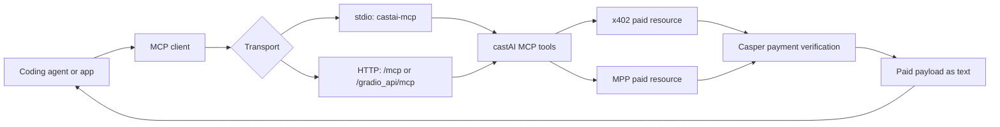

import { PackageInstall } from "@/components/package-manager-tabs";

## Install

<PackageInstall packages="@castaisdk/cli @castaisdk/mcp" />

## CLI

```sh
castai templates
castai scaffold next-checkout ./my-checkout --package-manager pnpm
castai scaffold agent-vercel-ai ./my-agent --package-manager npm
castai scaffold mcp-claude-code ./claude-code-castai --package-manager bun
castai doctor --json
```

Templates:

- `next-checkout`: Next.js checkout UI with a server-owned x402 fetcher.
- `agent-vercel-ai`: Vercel AI SDK agent with castAI tools.
- `mcp-claude-code`: Claude Code MCP config.

## MCP Server

Use stdio for local coding agents that spawn the server as a child process.
Use Streamable HTTP when the MCP server is hosted on a normal web URL.

stdio:

```sh
castai-mcp
```

Streamable HTTP:

```sh
PORT=7860 castai-mcp-http
```

Local URLs:

| Purpose | URL |
| --- | --- |
| MCP Streamable HTTP | `http://localhost:7860/mcp` |
| Hugging Face MCP path | `http://localhost:7860/gradio_api/mcp` |
| Hugging Face SSE-compatible path | `http://localhost:7860/gradio_api/mcp/sse` |
| Health check | `http://localhost:7860/health` |

Hosted URL templates:

| Host | MCP URL |
| --- | --- |
| Any HTTP host | `https://<your-domain>/mcp` |
| Hugging Face Space | `https://<owner>-<space>.hf.space/gradio_api/mcp` |
| Hugging Face Space SSE path | `https://<owner>-<space>.hf.space/gradio_api/mcp/sse` |

MCP client config:

```json
{
  "mcpServers": {
    "castai": {
      "url": "https://<owner>-<space>.hf.space/gradio_api/mcp"
    }
  }
}
```

Health check:

```sh
curl https://<owner>-<space>.hf.space/health
```

Server paths:

- `/mcp`
- `/gradio_api/mcp`
- `/gradio_api/mcp/sse`
- `/health`

Hugging Face Docker Space template:

```txt
spaces/huggingface-mcp
```

MCP tools:

- `castai_doctor`
- `castai_pay_x402_resource`
- `castai_pay_mpp_resource`
- `castai_format_paid_resource`



Set signer configuration in the process environment:

```txt
CASTAI_CASPER_PRIVATE_KEY_PEM=
CASTAI_CASPER_PRIVATE_KEY_HEX=
CASTAI_CASPER_PUBLIC_KEY=
CASTAI_CASPER_NETWORK=casper:testnet
CASTAI_CASPER_KEY_ALGORITHM=ed25519
CASPER_PRIVATE_KEY_PEM=
CASPER_PRIVATE_KEY_HEX=
CASPER_NETWORK=casper:testnet
```

## Claude Code

Generate MCP config:

```sh
castai claude-code --package-manager pnpm --json
```

Plugin files live at:

```txt
plugins/claude-code/castai
```

The plugin contains `.claude-plugin/plugin.json`, `.mcp.json`, and a `castai` skill.
